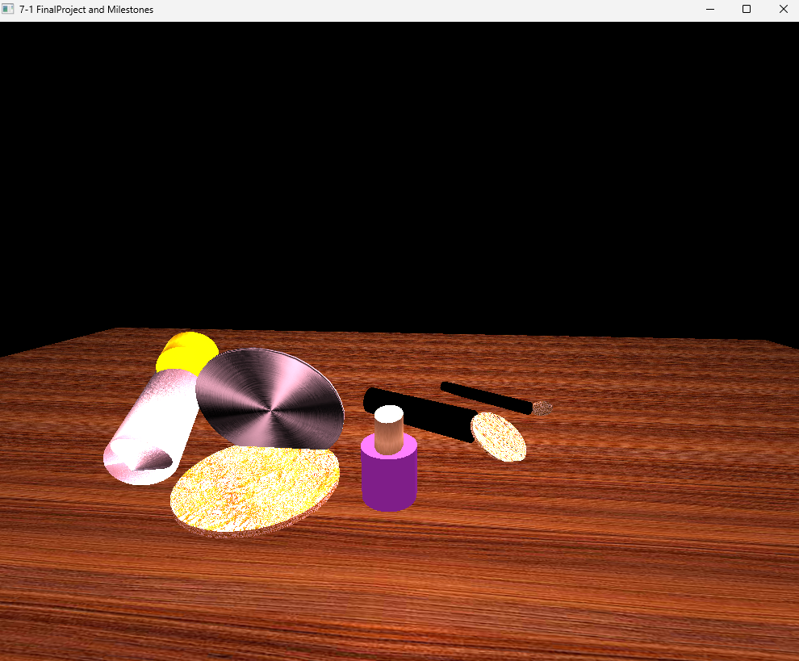

# 3D Graphics Scene – OpenGL

Author: Jessica Johnson  
Language: C++  
Graphics Library: OpenGL  

---

## Project Overview

This project is a 3D graphics scene built using OpenGL in C++. The goal was to design and render a small scene using geometric primitives, lighting, textures, and camera movement.

The scene represents a makeup vanity setup and includes objects such as a lip gloss container, compact, nail polish bottle, and brushes. Each object was constructed using combinations of basic shapes such as cylinders, spheres, and cones.

This project demonstrates how mathematical transformations and graphics pipelines can be used to create interactive 3D environments.

---
## Scene Preview



## Features

The project includes several core computer graphics concepts:

- Camera movement and scene navigation
- Object transformations (translation, rotation, scaling)
- Texture mapping
- Lighting models
- Shader usage
- Scene management in C++

---

## Technologies Used

- C++
- OpenGL
- GLSL Shaders
- Linear Algebra (matrix transformations)
- Visual Studio

---

## Project Structure
```
SceneManager.cpp — builds and renders scene objects
ShaderManager.cpp / .h — handles shader compilation and use
camera.h — camera movement and view control
textures/ — texture images used on objects
shaders/ — vertex and fragment shaders
Utilities/ — helper utilities
```

---

## Key Concepts Demonstrated

### Object Construction

Objects in the scene were built from primitive shapes including cylinders, spheres, and cones. These shapes were combined and transformed to form more complex objects.

### Transformations

Each object uses transformation matrices to control:

- position
- scale
- rotation

### Lighting

Lighting was applied to improve depth and realism in the scene. This includes directional lighting and surface shading using shader programs.

### Texture Mapping

Textures were applied to objects to simulate realistic materials.

---

## What I Learned

This project helped me understand how graphics programming works beneath the surface. Instead of simply drawing shapes, I learned how transformations, shaders, and lighting interact within the rendering pipeline to create a complete scene.

It also reinforced how mathematical concepts like matrices and coordinate systems are used directly in real-world software applications.

---

## Future Improvements

Possible enhancements could include:

- additional lighting models
- more complex object geometry
- interactive controls for scene manipulation
- physics-based animations

---

## Course

Southern New Hampshire University  
CS 330 – Computational Graphics and Visualization
